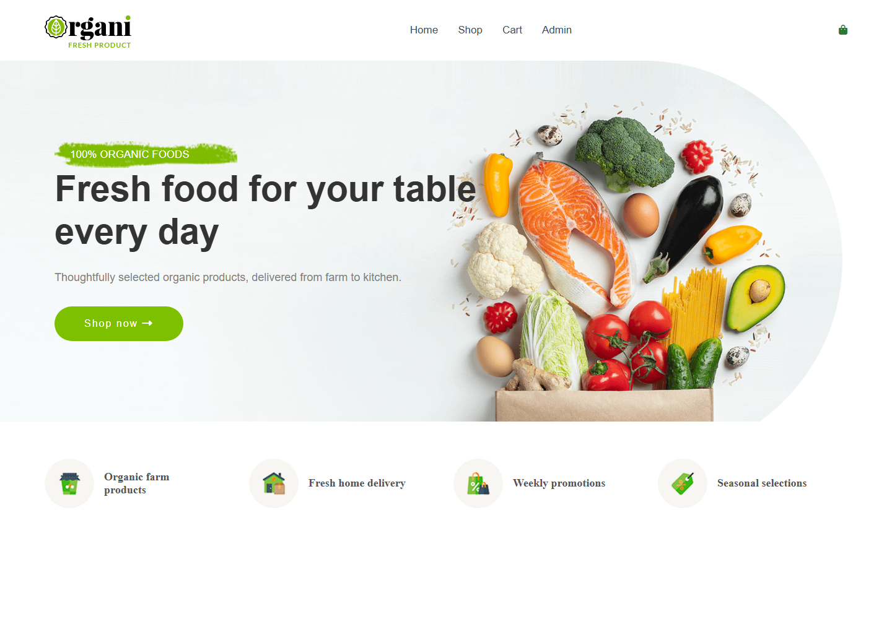
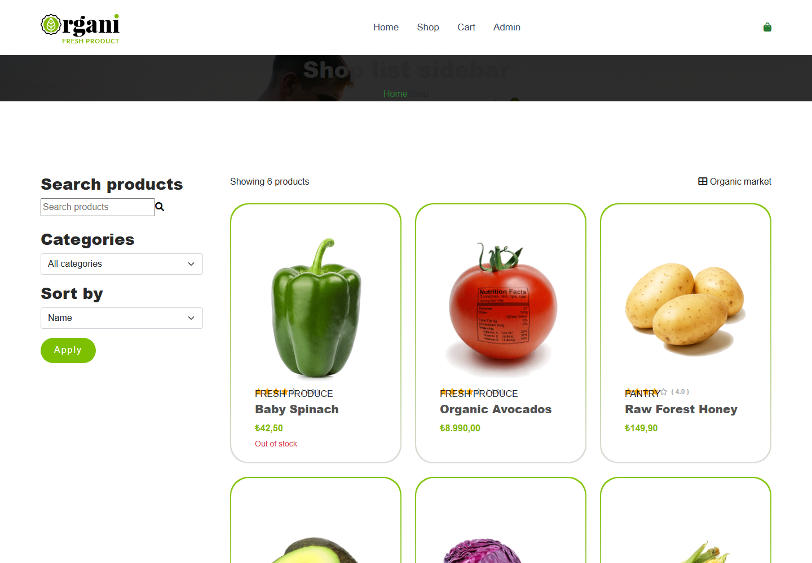
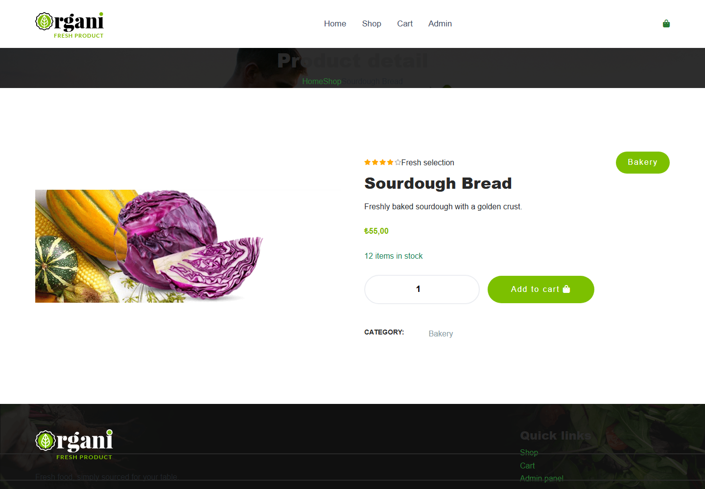
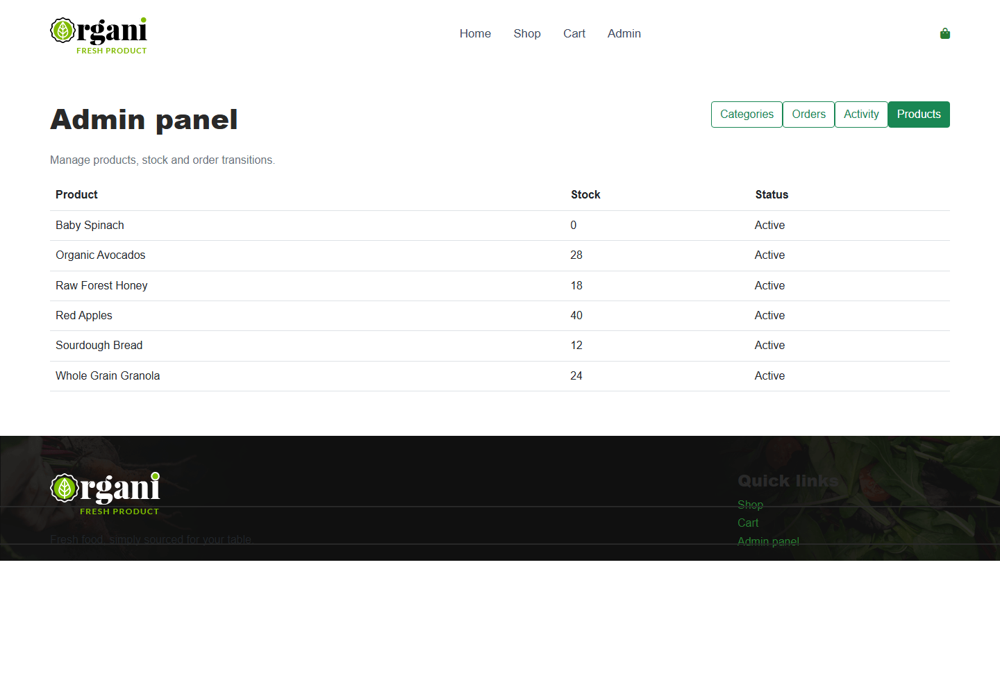

# Organi | Design Patterns E-Commerce Project

> **M&Y Eğitim Akademi Full Stack .NET Bootcamp — Proje 8**

Organi; ASP.NET Core MVC ve SQL Server ile geliştirilmiş, organik ürün satış senaryosunu temel alan bir e-ticaret uygulamasıdır. Projenin ana odağı yalnızca CRUD ekranları oluşturmak değil; e-ticaret akışındaki gerçek problemlere uygun Design Pattern çözümleri uygulamaktır.

Müşteri arayüzünde ürün listeleme, filtreleme, sepet ve sipariş oluşturma akışı; yönetim tarafında ise kategori/ürün yönetimi, stok görüntüleme, sipariş durum geçişleri ve işlem kayıtları bulunur.

## Ekran Görüntüleri

### Ana Sayfa



### Mağaza ve Filtreleme



### Ürün Detayı



### Yönetim Paneli



## Öne Çıkan Özellikler

- Organic temaya uyarlanmış responsive müşteri arayüzü
- SQL Server üzerinde dinamik ürün ve kategori verisi
- Sunucu taraflı ürün arama, kategori filtresi, sıralama ve sayfalama
- Session anahtarıyla eşlenen, veritabanında tutulan sepet işlemleri
- Kargo yöntemi seçimiyle checkout toplamı hesaplama
- Ürün ve kategori yönetimi için Admin Area
- Sipariş yaşam döngüsü ve kontrollü durum geçişleri
- Stok hareketi, admin bildirimi ve audit kayıtları
- EF Core migration ve seed data desteği

## Kullanılan Teknolojiler

| Alan | Teknolojiler |
|---|---|
| Backend | .NET 9, ASP.NET Core MVC, C# |
| Veri erişimi | Entity Framework Core, SQL Server / LocalDB |
| Frontend | Razor Views, Bootstrap, Organic HTML Theme |
| Mimari | Layered Monolith |

## Mimari

```text
src/
├── Case8.Web/             MVC, Razor Views, Admin Area, tema entegrasyonu
├── Case8.Application/     Checkout, shipping, validation ve observer akışları
├── Case8.Domain/          Entity'ler ve sipariş state davranışları
└── Case8.Infrastructure/  EF Core, DbContext, SQL Server ve Unit of Work
```

Bu yapı, web katmanını iş kurallarından; iş kurallarını da veri erişim ayrıntılarından ayırır.

## Design Patterns

Projede, yalnızca gerçek bir iş problemine karşılık gelen **5 Design Pattern** kullanılmıştır.

| Pattern | Çözdüğü Problem | Projedeki Kullanım |
|---|---|---|
| Strategy | Kargo hesaplama algoritmaları değişebilir | Standard, Express ve Store Pickup seçenekleri |
| Chain of Responsibility | Checkout doğrulamalarını tek bir metoda yığmamak | Cart, aktif ürün, stok ve adet limiti doğrulamaları |
| Unit of Work | Sipariş sırasında kısmi veri kaydını engellemek | Order, stock, stock movement ve cart işlemlerinin tek transaction içinde yürütülmesi |
| State | Sipariş durum kurallarını controller’dan ayırmak | Pending, Preparing, Shipped, Delivered ve Cancelled durumları |
| Observer | Başarılı sipariş sonrası bağımsız yan etkileri ayırmak | Admin notification ve audit log kayıtları |

### 1. Strategy Pattern — Kargo Hesaplama

Kargo seçeneğine göre fiyat değiştiği için controller içinde büyüyen `if/switch` blokları yerine her yöntem kendi hesabını yapan bir strategy olarak tasarlanmıştır.

```text
Checkout
   ↓
ShippingCalculator
   ├── StandardShippingStrategy
   ├── ExpressShippingStrategy
   └── StorePickupShippingStrategy
```

Yeni bir teslimat yöntemi eklendiğinde mevcut hesaplama kodunu değiştirmek yerine yeni bir strategy eklemek yeterlidir.

### 2. Chain of Responsibility — Checkout Validation

Sipariş oluşturulmadan önce gereken kontroller sırayla çalışır. Herhangi bir kontrol başarısız olduğunda zincir durur ve sipariş oluşturulmaz.

```text
CartNotEmpty
   ↓
ProductActive
   ↓
StockAvailable
   ↓
QuantityLimit
```

Örneğin stok yoksa `StockAvailableHandler` işlem akışını keser. Böylece stokta olmayan ürün için sipariş oluşturulması engellenir.

### 3. Unit of Work — Atomic Checkout

Checkout sırasında aşağıdaki veriler bir bütün olarak ele alınır:

```text
Order oluştur
   ↓
OrderItem'ları ekle
   ↓
Stok düş
   ↓
StockMovement kaydı ekle
   ↓
Sepeti temizle
   ↓
Transaction commit
```

Adımlardan biri hata verirse transaction rollback olur. Böylece sipariş kaydedilip stok düşmemesi veya stok düşüp sepetin temizlenmemesi gibi tutarsızlıklar oluşmaz.

### 4. State Pattern — Sipariş Yaşam Döngüsü

Sipariş durum değişiklikleri controller içinde merkezi `if/switch` yapılarıyla yönetilmez. Her state kendi geçiş kuralını taşır.

```text
Pending → Preparing → Shipped → Delivered
   │           │
   └──────→ Cancelled ←──────┘
```

Örneğin `Shipped → Preparing` geçişi geçersizdir ve domain tarafından reddedilir.

### 5. Observer Pattern — Sipariş Sonrası İşlemler

Sipariş transaction’ı başarıyla tamamlandıktan sonra bağımsız işlemler observer’lara bildirilir.

```text
Order committed
   ↓
OrderPlacedPublisher
   ├── AdminNotificationObserver
   └── AuditLogObserver
```

Stok düşümü observer içinde yapılmaz. Bu işlem siparişin zorunlu bir parçası olduğu için Unit of Work transaction sınırında kalır.

## Kurulum

### Gereksinimler

- .NET 9 SDK
- SQL Server LocalDB veya SQL Server
- Entity Framework Core CLI

### Adımlar

1. Repository’yi klonlayın.
2. Connection string’i gerekirse `src/Case8.Web/appsettings.json` üzerinden kendi SQL Server instance’ınıza göre güncelleyin.
3. Migration’ları uygulayın:

```powershell
dotnet ef database update --project src/Case8.Infrastructure --startup-project src/Case8.Web
```

4. Uygulamayı çalıştırın:

```powershell
dotnet run --project src/Case8.Web
```

5. Tarayıcıdan uygulamayı açın:

```text
http://localhost:5045
```

## Uygulama Rotaları

| Alan | Rota |
|---|---|
| Ana sayfa | `/` |
| Mağaza | `/Shop` |
| Sepet | `/Cart` |
| Checkout | `/Checkout` |
| Admin Dashboard | `/Admin` |
| Ürün Yönetimi | `/Admin/Products` |
| Kategori Yönetimi | `/Admin/Categories` |
| Sipariş Yönetimi | `/Admin/Orders` |
| Bildirim / Audit Kayıtları | `/Admin/Activity` |

---

**Organi**, M&Y Eğitim Akademi Full Stack .NET Bootcamp kapsamında geliştirilmiş bir Design Patterns proje çalışmasıdır.
